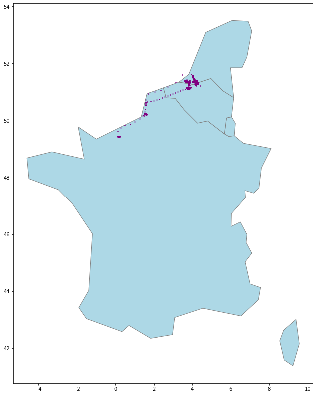
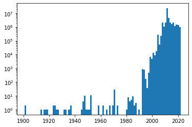
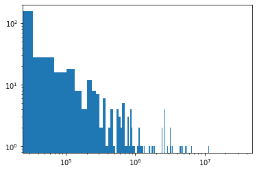
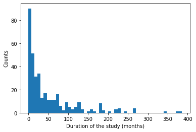

# Project of Data Visualization (COM-480)

| Student's name  | SCIPER |
|-----------------|--------|
| Ruben Burdin    | 338367 |
| Lovro Nuic      | 338203 |
| Fabrizio Forte  | 328932 |

[Milestone 1](#milestone-1-friday-8th-april-5pm) • [Milestone 2](#milestone-2-friday-6st-may-5pm) • [Milestone 3](#milestone-3-friday-3rd-june-5pm)

## Milestone 1 (Friday 8th April, 5pm)
**10% of the final grade**

### Dataset
#### About the Dataset
Our team has found an original dataset that is very interesting to visualize. The dataset is called movebank, it is a collection of scientific studies about animal migration worldwide. For instance, groups of biologists conducting studies on the move of a certain bird, tiger, or whale using sensors over an extended period of time can make their data public in this data warehouse.
This dataset is rich and is provided in a relatively clean data format. Since the focus of the course is on data visualization and not data processing, this is an optimal choice. In addition, the storytelling that can be leveraged from this dataset is great (see next report section).

#### Data Retrieval
First, we had to retrieve the data from the movebank website. Movebank is not an aggregate dataset but is made of several independent studies submitted by different teams. 
The dataset used for this project is an aggregated version of several of these studies since we would like to provide insights for several species and time periods. 
We aggregated 373 studies into a dataset of 1.74 GB volume and approximately 43 million rows in total. 
Some of the studies are very large and contain more than 100MB of data each. 
For ease of computation, we decided to remove these large studies keeping a majority of studies (thus data insights) but removing a significant part of the data volume. 
This data aggregation constituted a non-negligible amount of time and effort.

#### Pre-processing
The movebank dataset has a standard data schema for submission by scientific teams. Thus, the data was very clean and complete. We performed some simple reformatting actions on the dataset and segmentation. Data quality is great overall.

For later processing, we will store all the data in a Google BigQuery data warehouse or SQL database, so we could enable server-side computation and thus speed up the rendering on the client-side application (the user interface). This will enable us to visualize a significant amount of data without slowing down the user’s computer.

#### Problematic
The general topic of our visualization is the worldwide migration of animals over time. Our goal is to intuitively and interactively show some animal migration flows across several types of data visualizations such as maps, charts, statistics,... and more!
Our team is captivated by this project since we think it is genuinely interesting to show fellow students the way some familiar (or less familiar) animation migrate across the globe, much further than one may think. Since we are working on scientific data, it is time to show the truth!

The target audiences are our fellow students, friends, and families that would like to learn about the topic.

During the pre-processing of the data, we have plotted in python (for fast and convenient prototyping) some proofs-of-concept.

    
     
    <em>Figure 1: In purple, the data about a single animal in a study of our dataset, over a blue map of central European countries.</em>

    
     
    <em>Figure 2: Several studies were plotted in the same world map. Every study is in a different color.</em>

Figure 2. represents the main visualization that we would like to develop. One can see that the studies are covering several animal species and span a large number of countries internationally.
Our geo-visualization will be bundled with interactive filters to focus on certain studies/species/single animals/time periods. Users will be able to zoom in and out of certain regions and simulate time travel.

Other visualizations will be (all with interactive filters):
- Interactive bar-chart ranking of popular migratory countries across months and seasons
- Pie-chart of present species in a certain country
- Time series of the presence of animals in a certain region over time
- Interactive tree-map of with the largest squares being the counties to host the most animals. This is an animated chart over a time series acceleration.
- Information exploration about species retrieved from Wikipedia directly in-site displayed in a fancy fashion (linked to the wikidata database API)
- Additional statistics on the visualized data in the current window of the map (e.g. number of animals studies, km/week traveled by an average animal,...)
- Interactive map to compare trajectories in migration with other environmental studies
These visualizations will enable us to experiment with several gestalts, colours and other data visualization principles.

### Exploratory Data Analysis

#### Tracking animal events

Our data consists of 373 different studies, which were carried out in a period that spans more than a century. Of course they are not uniformly distributed in time. This is clearly visible in the histograms that we present below.

    
     
    <em>Figure 3: on the x-axis the year considered and on the y-axis the number of observations available for that year. The data used  for the plot is a subsample of ~10% of the dataset. It is clear that the data is not uniformly distributed in time, and most of it is concentrated in the last 20 years.</em>

Each study was conducted on a single animal species. 
Every row in the dataset refers to a collected measurement and has, as attributes, the geolocalization (latitude and longitude) the taxon canonical name, the study id, and the date of the measurements. 
In our dataset we have almost 400 Millions of such measurements, and they are not uniformly distributed among studies, as shown in figure 3. 
Removing, for instance, the 10 biggest studies could be a good idea, to avoid speed problems during our visualization. 

    
     
    <em>Figure 4: on the x-axis the dimension (in number of rows) of each study. On the y-axis the the counts. Both axis are in log scale.</em>

In our datasets there are more than 100 countries and more than 190 species studied. 
The following plots show the relative popularity among the top 15 countries and the top 10 species. 
These statistics are important to us, as it means that we have enough data to cover, with our visualizations, the whole globe and to realize one or multiple visualizations per species.

    
    
     
    <em>Figure 5: on the left, the 10 most popular species in the studies. The relative size of the block associated with each species is related to their relative size in the dataset. On the right, in a similar format, the 15 most popular countries.</em>

The median length of a study is of 25 months, with skewed distribution. This is also relevant for our visualization, as we will be able to animate the study in time, using multiple time scales

    
     
    <em>Figure 6: Distribution of the lengths of each study. Outlier values (distant more than 3 standard deviations from the mean) were excluded from the plot.</em>

#### About animals

Another look at our data is which animals exist in the dataset and what their evolutionary relationships are. 
This data will help us to be able to compare animals and organize the data into related groups.

    
     
    <em>Figure 7: Phylogenetic tree of animals with tracking data.</em>

In the figure 7. we can see that the dataset contains animals from 3 classes: Aves, Mammalia, Reptilia. The most numerous are animals from the Aves class, but it is interesting that it contains data on birds that migrate, do not migrate, and even do not fly.

<table>
<tr>
  <th>Buceros bicornis</th>
  <th>Panthera onca</th>
  <th>Chelonia mydas</th>
</tr>
<tr>
  <td style="padding: 0px!important"></td>
  <td style="padding: 0px!important"></td>
  <td style="padding: 0px!important"></td>
</tr>
<tr>
 <td>by: Seasidesaltlife - <a href="https://creativecommons.org/licenses/by-sa/4.0/">CC BY-SA 4.0</a></td>
 <td>by: Charles J. Sharp - <a href="https://creativecommons.org/licenses/by-sa/4.0/">CC BY-SA 4.0</a></td>
 <td>by: Angadachappa - <a href="https://creativecommons.org/licenses/by-sa/4.0/">CC BY-SA 4.0</a></td>
</tr>
</table>

<em>Figure 8: Example of animals from the dataset.</em>

### Related work

#### What others have already done with the data?

- Movebank dataset summarizer ([link](https://robitalec.github.io/move-book/index.html)) 
  - Summarizes data sets showing bounding boxed of animal movement in studies and general information about study.
- DynamoVis ([link](https://github.com/move-ucsb/DynamoVis))
  - An interactive tool for the exploratory visualization of animal movement data. Made for biologists in the form of desktop applications.

#### Why is our approach original?

While there is scientific research on the individual studies, there is no visualization that would combine the data of different studies and show animal migrations in an interactive way.
Our goal is to present data on migration to non-experts in accessible way and show the dynamism of the animal world that is greater than we usually think.

**This is our first time using this dataset.**

#### Sources of inspiration:

|                    StarLink Satellite Map  ([link](https://satellitemap.space/))                     |
|:--------------------------------------------------------------------------------------------------------------------:|
|  |

|          Global animal movements based on Movebank data ([link](https://www.youtube.com/watch?v=nUKh0fr1Od8))           |
|:-----------------------------------------------------------------------------------------------------------------------:|
|  |

## Milestone 2 (Friday 6st May, 5pm)

**10% of the final grade**

## Milestone 3 (Friday 3rd June, 5pm)

**80% of the final grade**

Github: https://github.com/com-480-data-visualization/datavis-project-2022-vizsquad

Website: https://data-viz-course-frontend-e4sglwkopa-uc.a.run.app/ 

Video: https://drive.google.com/drive/folders/1wq44vAApNfggwb3BWWg4OhasPRtrd84G?usp=sharing 
